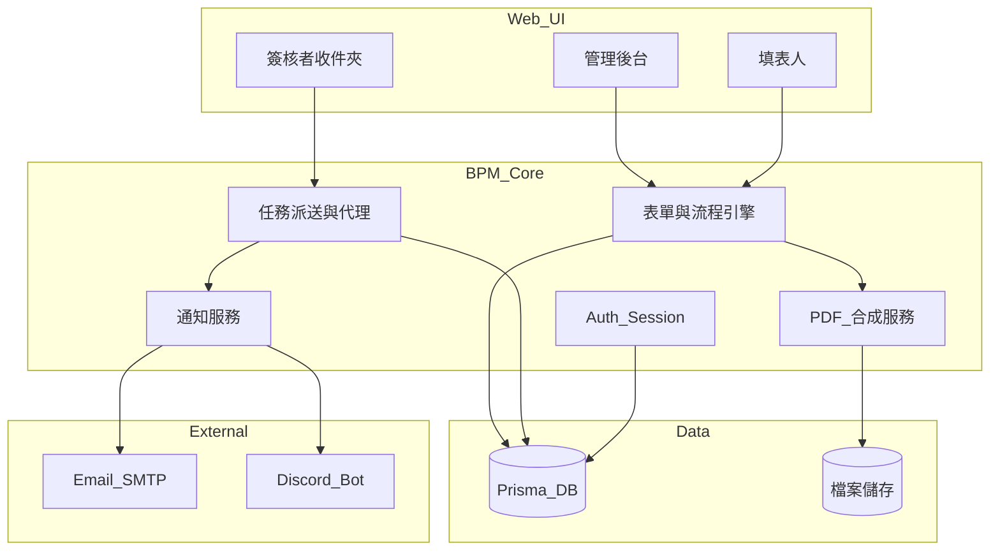
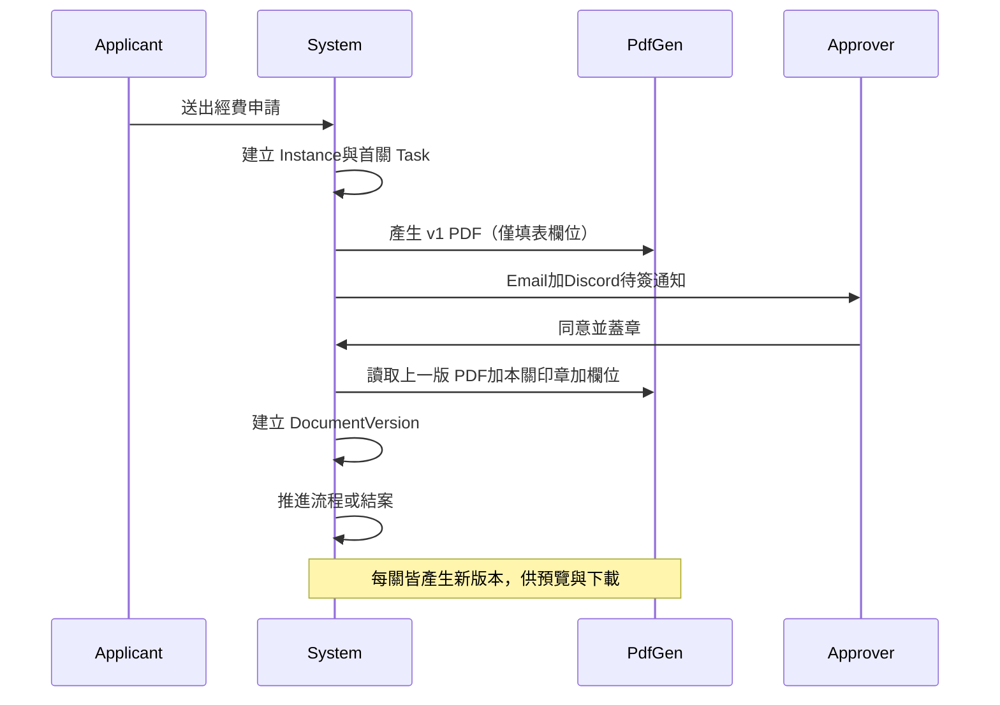

# BPM-Prototype 實作計劃

> 版本：1.0  
> 最後更新：2026-05-19  
> 相關文件：[規格書](./規格書.md)

## 概述

從零建置內部單位（約 10–30 人）使用的簡易 BPM 系統，涵蓋帳號管理、收件夾、可設定簽核流程、經費請款表單、PDF 模板座標對應、每關簽核更新 PDF 並疊加個人電子章，以及 Email / Discord 私訊通知。

工作區目前僅有 Git 初始化，無既有應用程式碼，可依本計劃直接開發。

---

## 需求摘要（已確認）

| 項目 | 決策 |
|------|------|
| 使用者 | 內部約 10–30 人 |
| 部署 | 先本機原型，上線方式後續再定 |
| 表單 | 第一版：**經費/請款申請**；架構預留第二種表單與未來設計器 |
| 流程 | **每種表單可設定不同簽核流程**（含會簽） |
| 文件 | 上傳空白 PDF + **後台座標對應**；**每個簽核關卡更新 PDF** 並疊加已完成的個人章 |
| 印章 | **每位簽核者上傳自己的電子章** |
| 帳號 | Email + 密碼，**管理員建立帳號**（無自助註冊） |
| 收件夾 | 待簽 / 我送出 / 已完成 + **代理簽核** + **意見與退回重填** + **催辦** |
| 通知 | **Email** + **Discord Bot 私訊**簽核者 |
| 稽核 | **簽核歷程與意見**（第一版不做欄位級變更稽核） |

---

## 建議技術棧

| 層級 | 選型 | 理由 |
|------|------|------|
| 全端框架 | **Next.js (App Router) + TypeScript** | 前後端一體、適合內部工具、生態成熟 |
| 資料庫 | **Prisma + SQLite（本機）**，之後換 **PostgreSQL** | 原型零設定；上線僅改 `DATABASE_URL` |
| 驗證 | **Auth.js (NextAuth v5) Credentials** | Email/密碼、Session、角色擴充容易 |
| PDF 合成 | **pdf-lib** | 在既有 PDF 指定座標寫入文字、嵌入 PNG/JPG 印章 |
| PDF 預覽 | **pdf.js**（或 `react-pdf`） | 後台座標對應、簽核時預覽 |
| 檔案儲存 | 本機 `storage/` 目錄 | 模板 PDF、產出 PDF、印章圖；上線可改 S3 |
| Email | **Resend** 或 **Nodemailer + SMTP** | 待簽、退回、催辦 |
| Discord | **discord.js Bot** + **OAuth2 帳號綁定** | 私訊需使用者與 Bot 同伺服器且完成綁定 |

不採用 Word 郵件合併路線，以避免額外轉檔與版式漂移；以 **PDF 為唯一真實底稿** 較符合「指定位置蓋章」需求。

---

## 系統架構（邏輯）



---

## 核心資料模型（概念）

- **User**：email、密碼雜湊、姓名、角色（`admin` / `user`）、個人印章檔路徑、`discordUserId`（綁定後）
- **FormTemplate**：名稱（如「經費請款」）、欄位定義 JSON Schema、關聯 `WorkflowTemplate`、關聯 `DocumentTemplate`
- **WorkflowTemplate**：步驟陣列（順序、類型 `serial` | `parallel`、指派規則：固定人 / 角色 / 由表單欄位指定）
- **DocumentTemplate**：原始 PDF 檔、欄位對應清單 `{ fieldKey, page, x, y, fontSize }`、各簽核關卡印章槽 `{ stepId, page, x, y, width, height }`
- **ProcessInstance**：表單實例、狀態、目前步驟、申請人
- **FormData**：JSON 欄位值
- **Task**：待辦（指派人、代理人、狀態、到期可催辦）
- **ApprovalRecord**：動作（同意/退回/代理）、意見、操作者、時間戳
- **DocumentVersion**：每次簽核後產生的 PDF 版本編號與檔案路徑

---

## 簽核與 PDF 更新流程



### PDF 合成規則（第一版）

1. 以 `DocumentTemplate` 的空白 PDF 為底。
2. 依 `fieldMappings` 將 `FormData` 文字繪製到對應 `(page, x, y)`（座標系以 pdf-lib 預設為準，後台需提供「預覽校正」）。
3. 對**已完成**的簽核步驟，依 `sealSlots[stepId]` 嵌入該步驟簽核者上傳的印章圖（等比縮放至 slot 寬高）。
4. 儲存為 `DocumentVersion N`，並在 UI 提供「目前版 PDF」下載。

---

## 功能模組與實作順序

### 階段 1：專案骨架與帳號（約 1 週）

- [ ] 初始化 Next.js、Prisma、Auth.js、基本 Layout（繁中 UI）
- [ ] 角色：`admin` 可管理使用者；一般使用者可填表與簽核
- [ ] 管理員：建立/停用帳號、重設密碼
- [ ] 個人設定：上傳/更換**個人電子章**（PNG 透明底為佳）

### 階段 2：表單與可設定流程（約 1–1.5 週）

- [ ] **經費請款**固定欄位（見規格書）
- [ ] 管理後台：**流程範本編輯器**（步驟新增/排序、指定簽核人或用角色、會簽關卡標記 `parallel`）
- [ ] 申請人：填寫、草稿、送出
- [ ] 流程引擎：狀態機推進、建立 Task、退回至申請人重填

### 階段 3：PDF 模板與座標對應（約 1 週）

- [ ] 管理員上傳 PDF 模板
- [ ] **座標對應 UI**（第一版務實做法）：
  - PDF 預覽 + 點擊放置欄位錨點（或拖曳調整）
  - 側邊欄選擇表單欄位 key、字級、對應頁碼
  - 為每個流程步驟設定「印章放置區」矩形
- [ ] 儲存至 `DocumentTemplate`

### 階段 4：簽核收件夾與 PDF 每關更新（約 1 週）

- [ ] 收件夾分頁：待我簽核 / 我送出的 / 已完成 / 我代理的
- [ ] 簽核頁：表單內容、歷程、PDF 預覽、同意/退回、意見必填（退回時）
- [ ] **代理簽核**：使用者設定代理人與有效期；Task 可改派
- [ ] **催辦**：對逾期待簽 Task 一鍵催辦（記錄催辦時間，避免 24h 內重複轟炸）
- [ ] 每次同意後呼叫 `PdfGen` 產生新版本

### 階段 5：通知（約 3–5 天）

- [ ] **Email**：新任務、退回、催辦（含深連結到該 Task）
- [ ] **Discord Bot 私訊**：
  - 建立 Discord Application，Bot 加入指定 Discord 伺服器
  - 使用者於「個人設定」走 OAuth2 綁定 `discordUserId`
  - 派送待簽時發送私訊
  - 注意：使用者須與 Bot 共用伺服器，且未封鎖 Bot

### 階段 6：打磨與文件

- [ ] README：本機啟動、環境變數、Discord Bot 設定步驟
- [ ] 種子資料：admin 帳號、示範流程、示範 PDF 模板

---

## 目錄結構（規劃）

```
BPM-Prototype/
├── Design/                     # 設計與規格文件
├── prisma/schema.prisma
├── src/
│   ├── app/                    # Next.js 路由
│   │   ├── (auth)/login/
│   │   ├── inbox/              # 收件夾
│   │   ├── forms/[templateId]/ # 填表與詳情
│   │   └── admin/              # 使用者、流程、PDF 模板
│   ├── lib/
│   │   ├── auth.ts
│   │   ├── workflow/           # 狀態機
│   │   ├── pdf/                # pdf-lib 合成
│   │   └── notify/             # email + discord
│   └── components/
├── storage/                    # gitignore：pdf、seals、generated
└── README.md
```

---

## 環境變數（預留）

| 變數 | 用途 |
|------|------|
| `DATABASE_URL` | 資料庫連線 |
| `AUTH_SECRET` | Session 簽章 |
| `SMTP_*` 或 `RESEND_API_KEY` | Email 通知 |
| `DISCORD_BOT_TOKEN` | Bot 私訊 |
| `DISCORD_CLIENT_ID` | OAuth 綁定 |
| `DISCORD_CLIENT_SECRET` | OAuth 綁定 |
| `DISCORD_GUILD_ID` | 可選，限制僅授權成員可綁定 |

---

## 風險與取捨

| 風險 | 因應 |
|------|------|
| PDF 座標與實際列印有偏差 | 後台提供「測試產生 PDF」按鈕；文件註明座標原點與單位 |
| Discord 私訊送不出 | 綁定引導、失敗時 fallback Email、記錄通知失敗 log |
| 第一版就要「可設定流程」複雜度高 | 流程編輯器先做「線性 + 單一會簽關」；條件分支（金額>X 走不同路）留第二版 |
| 每關都產 PDF 佔空間 | 保留最近 N 版或僅保留里程碑版（可設定）；MVP 先全保留 |

---

## 本機啟動（完成後目標）

```bash
npm install
npx prisma migrate dev
npm run db:seed      # admin + 示範模板
npm run dev          # http://localhost:3000
```

---

## 後續擴充（不在第一版，架構預留）

- 第二種表單（請假單等）僅新增 `FormTemplate` + PDF 模板
- 視覺化表單設計器（拖拉欄位）
- 條件式路由（依金額分關）
- 欄位級稽核、PDF 數位簽章（非圖章疊圖）

---

## 待確認事項

經費請款的**預設簽核關卡**要幾關、各關職稱名稱為何？若暫無定案，實作時會用「主管 → 會計 → 核准人」三關示範，並可在管理後台修改。
