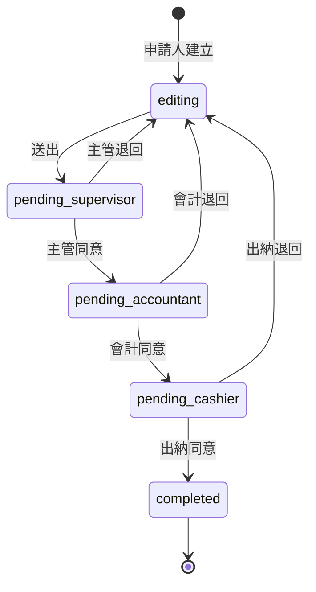

# BPM-Prototype 展示原型規格書

> 版本：1.0  
> 最後更新：2026-05-19  
> 狀態：需求已確認  
> 相關文件：[規格書](./規格書.md)（正式版）、[實作計劃](./實作計劃.md)

---

## 1. 文件目的

本規格書定義**展示／說明用互動原型**的範圍與驗收標準。此原型用於向內部說明 BPM 操作流程與紙本文件產出概念，**不是**正式上線系統。

與 [規格書.md](./規格書.md) 的關係：

| 項目 | 正式版規格書 | 本展示原型 |
|------|--------------|------------|
| 目標 | 可日常使用的內部 BPM | 可操作的流程示範 |
| 帳號登入 | 需要 | **不需要** |
| 角色 | 綁定真實使用者 | **頂部下拉切換角色** |
| 流程設定 | 後台可設定 | **寫死 3 關** |
| PDF 模板 | 後台上傳 + 座標 UI | **Repo 內固定 PDF + 寫死座標** |
| 部署 | 待定 | **GitHub Pages 靜態網站** |

---

## 2. 原型目標

### 2.1 要讓觀眾看到什麼

1. **申請人**填寫出帳申請單並送出。  
2. 切換為 **主管 → 會計 → 出納**，在**收件夾**依序完成簽核。  
3. 每一關簽核後，可預覽／下載**逐步更新的 PDF**（欄位填入 + 已蓋上的示範章）。  
4. 可示範**退回重填**後再送、**簽核歷程**時間軸、收件夾三分頁（待簽／我送出／已完成）。

### 2.2 成功標準（一句話）

一位未看過規格的人，在 5–10 分鐘內能跟著操作完「填單 → 三關簽核 → 下載成品 PDF」，並理解正式版會補上帳號、通知、後台設定等功能。

---

## 3. 技術與部署

### 3.1 呈現方式

| 項目 | 決策 |
|------|------|
| 類型 | **純靜態前端**（無後端、無資料庫） |
| 建議技術 | Vite + React + TypeScript |
| PDF | **pdf-lib**（瀏覽器端合成） |
| 狀態儲存 | **localStorage** |
| 部署 | **GitHub Pages**（`main` 分支或 `gh-pages`） |
| 本機開發 | `npm run dev` |

### 3.2 為何選靜態站

- 符合「展示用、快速上架」：push 即可透過 GitHub 提供連結。  
- 免伺服器與帳號系統，降低建置成本。  
- 正式版仍可依 [實作計劃](./實作計劃.md) 另建 Next.js 全端專案；展示版程式可部分複用（表單元件、pdf-lib 座標設定）。

### 3.3 資料保留策略

- 平常操作寫入 **localStorage**，方便同一場簡報連續 demo。  
- 提供 **「重置示範資料」** 按鈕：清空案件、還原種子資料（可選預載一筆「進行中」範例單）。  
- 不提供雲端同步或多裝置共用。

---

## 4. 複雜功能簡化對照（繞過方式）

正式版較重、展示版刻意不做的項目如下：

| 正式版功能 | 展示版做法 |
|------------|------------|
| Email / Discord 通知 | **不做**；以收件夾待辦數量提示即可 |
| 帳號登入 | **不做**；改為**角色下拉選單** |
| 管理員建帳、重設密碼 | **不做** |
| 使用者上傳個人章 | **不做**；Repo 內建 3 張 PNG（主管／會計／出納） |
| 後台 PDF 座標編輯器 | **不做**；座標寫在 `pdf-layout.ts` 設定檔 |
| 每種表單可設定流程 | **不做**；固定 **主管 → 會計 → 出納** |
| 會簽、代理簽核、催辦 | **不做** |
| 簽核意見必填 | **不做**（展示版不顯示意見欄，歷程僅記錄「同意／退回」） |
| 草稿儲存 | **不做**；填完直接送出或關閉 |
| 附件上傳 | **不做**；以文字欄位代替 |
| 欄位級稽核 | **不做**；僅**簽核歷程**時間軸 |
| 多表單類型 | **不做**；僅**出帳申請單**一種 |
| 即時 JPG 輸出 | **不做**；僅 **PDF 下載** |

---

## 5. 角色切換（取代帳號）

### 5.1 角色清單

| 角色 ID | 顯示名稱 | 說明 |
|---------|----------|------|
| `applicant` | 申請人 | 填表、送出、被退回後修改重送、檢視「我送出的」 |
| `supervisor` | 主管 | 第一關簽核 |
| `accountant` | 會計 | 第二關簽核 |
| `cashier` | 出納 | 第三關簽核（通過後結案） |

### 5.2 UI 行為

- 全站頂部固定 **「目前角色：▼」** 下拉選單，切換後立即更新收件夾與可用按鈕。  
- **不驗證身份**：任何訪客皆可切換任一角色的視角（展示用假設信任環境）。  
- 畫面可選顯示淡色提示：「展示模式：目前為【主管】視角」。

### 5.3 權限對照（簡化規則）

| 操作 | 申請人 | 主管 | 會計 | 出納 |
|------|--------|------|------|------|
| 新增／編輯出帳單（草稿態） | ✓ | — | — | — |
| 送出申請 | ✓ | — | — | — |
| 待簽清單中看到該單 | — | 第 1 關時 | 第 2 關時 | 第 3 關時 |
| 同意 | — | ✓ | ✓ | ✓ |
| 退回 | — | ✓ | ✓ | ✓（退回給申請人） |
| 下載 PDF | ✓ | ✓ | ✓ | ✓ |

---

## 6. 出帳申請單（表單）

### 6.1 表單名稱

**出帳申請單**（展示用；對應正式版「經費／請款」類流程，用語依內部慣例）。

### 6.2 欄位（標準版）

| 欄位 | 類型 | 必填 | 說明 |
|------|------|------|------|
| 申請日期 | 日期 | 是 | 預設今天 |
| 申請人姓名 | 文字 | 是 | 依目前角色自動帶入「展示用申請人」或手動可改 |
| 用途說明 | 多行文字 | 是 | |
| 費用明細 | 動態列 | 是 | 至少 1 列；欄位：項目、金額、備註（選填） |
| 合計金額 | 數字 | — | 唯讀，自動加總 |
| 受款人／帳號資訊 | 多行文字 | 是 | 展示用一行即可 |

### 6.3 表單狀態

| 狀態 | 說明 |
|------|------|
| `editing` | 退回後申請人可編輯 |
| `pending_supervisor` | 待主管簽 |
| `pending_accountant` | 待會計簽 |
| `pending_cashier` | 待出納簽 |
| `completed` | 三關皆同意 |
| `rejected` | 已退回（語意上併入 `editing`，列表可標「已退回」） |

---

## 7. 簽核流程（固定）

- **僅線性三關**，無會簽、無跳關。  
- **退回**：任一簽核關退回後，狀態回到 `editing`，申請人修改後再次送出，從**主管**重新開始。  
- 歷程須記錄：時間、角色、動作（送出／同意／退回）。

---

## 8. 收件夾

### 8.1 分頁

| 分頁 | 篩選邏輯（依「目前角色」） |
|------|---------------------------|
| **待我簽核** | 狀態為「待我這一關」的案件 |
| **我送出的** | 僅**申請人角色**顯示有意義；其他角色可顯示空狀態或隱藏此分頁 |
| **已完成** | 狀態為 `completed` 的所有案件（各角色皆可查） |

**展示版建議**：非申請人角色時，「我送出的」分頁顯示說明文字「請切換為申請人角色」，避免混淆。

### 8.2 列表資訊

每筆顯示：單號（自動編號）、用途摘要、金額、狀態標籤、最後更新時間。  
點擊進入**案件詳情／簽核頁**。

---

## 9. 案件詳情頁

同一頁整合：

1. **表單內容**（唯讀或依狀態可編輯）  
2. **簽核歷程**（垂直時間軸）  
3. **文件區**：PDF 預覽（iframe 或新分頁）+「下載 PDF」按鈕  
4. **操作按鈕**（依角色與狀態顯示）：送出、同意、退回  

退回時：確認對話框即可，**不需填寫意見**（展示簡化）。

---

## 10. 文件產生（PDF）

### 10.1 策略（已確認：寫死模板 + 座標）

| 項目 | 說明 |
|------|------|
| 模板檔 | 置於 `public/templates/disbursement.pdf`（或同等路徑） |
| 座標設定 | `src/config/pdf-layout.ts` 內定義欄位與印章位置 |
| 產生時機 | 申請人**送出**時產生 v1；**每一關同意**後產生新版本 |
| 執行環境 | 瀏覽器端 pdf-lib，產出 Blob 供預覽／下載 |
| 儲存 | PDF 以 **Base64** 存入 localStorage（展示資料量小可接受；若過大可只存最新版） |

### 10.2 欄位繪製

將表單欄位依 `pdf-layout.ts` 的 `fieldMappings` 寫入對應頁面座標（文字）。

建議映射（實作時依真實模板微調）：

| fieldKey | 來源 |
|----------|------|
| `applyDate` | 申請日期 |
| `applicantName` | 申請人姓名 |
| `purpose` | 用途說明 |
| `lineItems` | 明細合併為一段文字或固定列印前 3 列 |
| `totalAmount` | 合計金額 |
| `payeeInfo` | 受款資訊 |

### 10.3 印章（內建示範圖）

| 關卡 | 圖檔（建議路徑） | 蓋章時機 |
|------|------------------|----------|
| 主管 | `public/seals/supervisor.png` | 主管同意後 |
| 會計 | `public/seals/accountant.png` | 會計同意後 |
| 出納 | `public/seals/cashier.png` | 出納同意後 |

- 印章為 **PNG 透明底**。  
- 依 `sealSlots` 的矩形等比縮放貼上。  
- 未簽關卡不顯示該章。

### 10.4 版本規則

| 版本 | 觸發 | 內容 |
|------|------|------|
| v1 | 申請人送出 | 填寫欄位，無章 |
| v2 | 主管同意 | 欄位 + 主管章 |
| v3 | 會計同意 | 欄位 + 主管章 + 會計章 |
| v4 | 出納同意 | 欄位 + 三枚章（結案版） |

退回後重送：清除簽核章版本鏈，自 v1 重新計算（或覆寫同一 `instanceId`）。

### 10.5 展示風險與因應

| 風險 | 因應 |
|------|------|
| 模板 PDF 與座標對不齊 | 開發時用「測試產生」按鈕；規格驗收前以實際正式空白表單掃描一次 |
| localStorage 容量 | 僅保留最新 PDF 或限制案件筆數（如最多 10 筆） |
| 行動裝置預覽 PDF | 展示以桌面瀏覽器為主；規格註明建議 Chrome |

---

## 11. 畫面清單（IA）

| 路由（建議） | 頁面 |
|--------------|------|
| `/` | 首頁：簡短說明 +「新增出帳申請」+ 進入收件夾 |
| `/forms/new` | 新增出帳申請單 |
| `/forms/:id` | 案件詳情（簽核／檢視） |
| `/inbox` | 收件夾（三分頁） |

全站共用：**角色切換器**、**重置示範資料**（可放在頁首或設定選單）。

---

## 12. 種子資料（重置後）

重置後建議狀態：

| 項目 | 內容 |
|------|------|
| 案件數 | 0 筆，或 1 筆「待主管簽」範例（可選，方便開場直接 demo 簽核） |
| 角色 | 預設選「申請人」 |
| 說明 | 首頁顯示 3 步驟操作提示 |

---

## 13. 建議 Demo 腳本（約 8 分鐘）

1. **首頁**：說明此為展示原型，無真實帳號。  
2. **申請人**：新增出帳單 → 填寫兩列明細 → 送出 → 收件夾「我送出的」看到待簽。  
3. **切主管**：待我簽核 → 同意 → 開啟 PDF 看 v2（主管章）。  
4. **切會計、出納**：重複同意 → 展示 v4 成品。  
5. **切回申請人**：新建一筆 → **切主管退回** → 申請人修改金額 → 再送 → 快速三關通過。  
6. **已完成**分頁：列出結案單據。  
7. **重置示範資料**：恢復初始狀態。

---

## 14. 不在展示版範圍（明確排除）

- 登入、密碼、權限管理後台  
- Email、Discord、催辦、代理簽核、會簽  
- 流程／模板後台設定  
- 附件上傳、草稿、簽核意見欄  
- 多表單類型、條件分支  
- 後端 API、真實資料庫  

---

## 15. 驗收準則

| # | 項目 |
|---|------|
| AC-01 | 可不登入，以角色下拉切換四種視角 |
| AC-02 | 申請人可建立並送出標準欄位出帳單 |
| AC-03 | 主管 → 會計 → 出納 依序僅在對應關卡出現待簽 |
| AC-04 | 任關可退回，申請人可編輯後重送，流程從主管重啟 |
| AC-05 | 收件夾具「待我簽核／我送出的／已完成」三分頁且篩選正確 |
| AC-06 | 詳情頁有簽核歷程時間軸 |
| AC-07 | 送出與每關同意後可下載對應版本 PDF，印章依關卡累加 |
| AC-08 | 「重置示範資料」可清空並恢復初始狀態 |
| AC-09 | 建置後可部署至 GitHub Pages，以公開 URL 存取 |

---

## 16. 與正式版的銜接

展示版驗證通過後，正式開發建議：

1. 將 `pdf-layout.ts`、表單欄位定義遷入正式專案。  
2. 展示版之 localStorage 狀態機邏輯，改為伺服器端 ProcessInstance / Task。  
3. 角色下拉改為真實登入 Session + 權限。  
4. 內建印章改為使用者上傳；座標改為後台 UI。  

---

## 17. 開放問題（實作前可再確認）

| 編號 | 問題 | 預設 |
|------|------|------|
| OQ-D01 | 是否需提供已排版好的正式空白 PDF？ | 若無，開發方先用 A4 示意模板，上線 demo 前替換 |
| OQ-D02 | 重置後是否預載一筆「待主管」範例單？ | 建議**有**，縮短現場等待時間 |
| OQ-D03 | GitHub Pages 網址路徑（project site vs user site） | 依 repo 名稱 `BPM-Prototype`，需設定 Vite `base` |

---

## 18. 需求決策紀錄

| 主題 | 決策 |
|------|------|
| 部署 | GitHub Pages 靜態站 |
| 資料 | localStorage + 重置按鈕 |
| PDF | 固定模板 + 寫死座標 |
| 流程 | 主管 → 會計 → 出納（3 關） |
| 角色 | 申請人、主管、會計、出納（下拉切換） |
| 收件夾 | 三分頁 |
| 展示操作 | 退回、歷程；不要見意見欄、草稿、附件 |
| 表單 | 標準欄位（明細列 + 合計） |
| 印章 | 內建 3 張 PNG |

---

## 19. 修訂紀錄

| 版本 | 日期 | 說明 |
|------|------|------|
| 1.0 | 2026-05-19 | 初版，依展示原型需求問答整理 |
